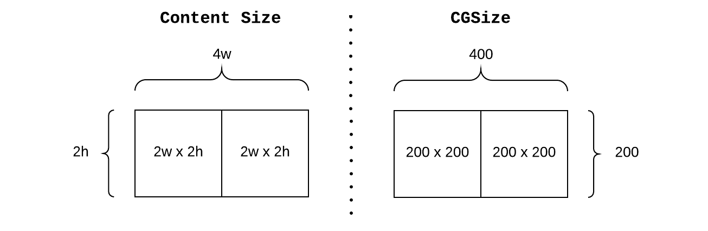
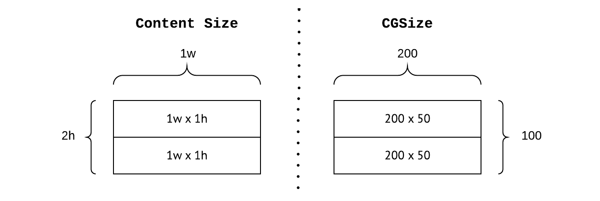
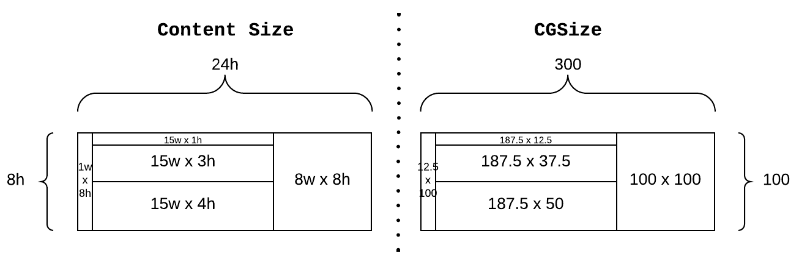
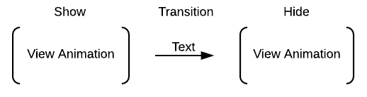

# Toast Notifications

Simple and yet robust Swift library to show non intrusive notifications in iOS. 

[](https://travis-ci.org/pman215/ToastNotifications)


## Features

+ Grid system to generate fixed layout content
+ Use attributed text or images as content elements
+ Modify the style, position and size of each notification 
+ Use multiple animations to show or hide each notification
+ Show multiple notifications sequentially
+ Cancel all notifications at any point in time
+ No Interface Builder required at all


## How to create a simple notification

A `Notification` is composed by the following types

+ Notification 
  - Content: Body composed by attributed text or images
  - Appearance: look and feel, size and position
  - Animation: How a it will show and hide

```swift
let content = Content(text: "Hello World!")
let appearance = Appearance()
let animation = Animation()

let notification = Notification(content: content,
                                appearance: appearance,
                                animation: animation)
```


## How to create content elements

The body of a notification is composed by one or many content elements of the following types:

+ Content Elements
  - Empty: Element used for spacing between elements
  - Attributed Text: Text formatted with attributes
  - Image: Graphic element

**Attributed Text Element**

+ Text Attributes
  - Font
  - Alignment
  - Foreground color
  - Background color

```swift
let attributes  = TextAttribute.foregroundColor(.white)
							   .map(.backgroundColor(.black))
                               .map(.alignment(.center))
                               .map(.font(UIFont(name: "GillSans", size: 20)!))
let text = "😎  Sun is shining 😎 "
let textElement = ContentElement(text: text,
                                 attributes: attributes)
```


**Image Elements**

```swift
let imageElement = ContentElement(imageName: "eagle.png")
```


## How to size and lay out content elements

Content elements can be combined to create compound content. In order to combine content use the layout operators.

The size of the resulting compound content is the sum of the size of all its subcontent elements.
 
**Layout operators**

+ Beside `|||`

```swift
let rightTextSize = ContentSize(width: 2, height: 2)
let rightText = ContentElement(text: "Right")
let rightTitle = Content(size: rightTextSize,
                         element: rightText)

let leftTextSize = ContentSize(width: 2, height: 2)
let leftText = ContentElement(text: "Left")
let leftTitle = Content(size: leftTextSize,
                        element: leftText)

let content = rightTitle ||| leftTitle
```



+ Stack `---`

```swift
let topTextSize = ContentSize(width: 1, height: 1)
let topText = ContentElement(text: "Top")
let topTitle = Content(size: topTextSize,
                       element: topText)

let bottomTextSize = ContentSize(width: 1, height: 1)
let bottomText = ContentElement(text: "Bottom")
let bottomTitle = Content(size: bottomTextSize,
                          element: bottomText)

let content = rightTitled --- leftTitle
```



+ Combining Operators

```swift
let horizontalSpacerSize = ContentSize(width: 1, height: 8)
let horizontalSpacerContent = Content(size: horizontalSpacerSize)

let verticalSpacerSize = ContentSize(width: 15, height: 1)
let verticalSpacerContent = Content(size: verticalSpacerSize)

let titleSize = ContentSize(width: 15, height: 3)
let title = ContentElement(text: "Title")
let titleContent = Content(size: titleSize,
                           element: title)

let subtitleSize = ContentSize(width: 15, height: 4)
let subtitle = ContentElement(text: "Subtitle")
let subtitleContent = Content(size: subtitleSize,
                              element: subtitle)

let iconSize = ContentSize(width: 8, height: 8)
let icon = ContentElement(imageName: "cat.png")
let iconContent = Content(size: iconSize,
                          element: icon)

let content = horizontalSpacerContent |||
	          (verticalSpacerContent --- titleContent --- subtitleContent) |||
              iconContent
```




## How to modify appearance

The appearance of a notification is divided as follows:

+ Appearance
  - Style: How the notification looks 
  - Position: Where the notification will show
  - Size: The area taken by the notification when shown on screen

```swift
let style = Style { (view) in
	view.layer.cornerRadius = 10
    view.clipsToBounds = true
    view.backgroundColor = UIColor.white.withAlphaComponent(0.8)
}
let position = Position.center
let size = Size(xRatio: 0.8, yRatio: 0.1)

let appearance = Appearance(style: style,
                            position: position,
                            size: size)
```

**Style**

A block of code with the following type `(UIView) - Void` used to modify the view's properties

```swift
let style = Style { (view) in
	    view.layer.cornerRadius = 50
		view.clipsToBounds = true
		view.backgroundColor = UIColor(red: 255/255, green: 215/255, blue: 0, alpha: 0.8)
}
```

**Position**

A notification can show in the following three positions. An offset can be added to top and bottom positions.

+ Position:
  - Top
  - Center 
  - Bottom

```swift
let position = Position.top(40)
```

**Size**

The size of a notification can be absolute or relative to its parent view

+ Absolute Size

A notification with a size of 100 x 100 points

```swift
let size = Size(width: 100, height: 100)
```

+ Relative Size

A notification with a width of 80% of its superview width and 10% of its superview height

```swift
let size = Size(xRatio: 0.8, yRatio: 0.1)
```

## How to animate a notification 

A notification is shown and hidden by a sequence of one or many `View Animation`s. Show animations will run first, then transition to run hide animations after. The transition from show to hide animations can be automatic or manual. A manual transition allows to control when to dismiss a notification.




```swfit
let showAnimation = ViewAnimation.duration(1)
    .options(.curveEaseIn)
	.initialState { (view) in
		view.alpha = 0
	}
    .finalState { (view) in
	    view.alpha = 1
    }

let hideAnimation = ViewAnimation.duration(1)
	.delay(2)
    .options(.curveEaseOut)
	.finalState { (view) in
		view.alpha = 0
	}

let animation = Animation(transition: .automatic,
                          showAnimations: [showAnimation],
                          hideAnimations: [hideAnimation])
```


## How to show and hide notifications

**Single Notification**

A notification only needs a view to show on screen. 

```swift
notification.show(in: view)

notification.hide()
```

**Multiple Notifications**

When multiple notifications can show in a single view, it is recommended to queue them into a `NotificationQueue`. Notifications will automatically show in the same order that were added. This mechanism will allow sequential presentation without overlapping notifications.

A `NotificationQueue` can cancel all notifications at any moment in time.

```swift
let notificationQueue = NotificationQueue(presenter: view)

notificationQueue.queue(firstNotification)
notificationQueue.queue(secondNotification)

notificationQueue.cancel()
```

## Complete Examples

```swift

class ViewController: UIViewController {

    lazy var notificationQueue: NotificationQueue = {
        return NotificationQueue(presenter: self.view)
    }()


    override func viewDidAppear(_ animated: Bool) {
        super.viewDidAppear(animated)
        showCurrentNotification()
    }

    func showCurrentNotification() {
        notificationQueue.queue(minimalNotification())
        notificationQueue.queue(compoundNotification())
        notificationQueue.queue(loadingNotification())
    }
}

private extension ViewController {

    func minimalNotification() -> Notification {

        func content() -> Content {

            let textAttributes = TextAttribute.foregroundColor(.black)
                .map(.alignment(.center))
                .map(.font(UIFont(name: "GillSans", size: 20)!))
            let text = "😎 Sun is shining 😎"
            let textElement = ContentElement(text: text,
                                             attributes: textAttributes)

            let textSize = ContentSize(width: 1, height: 1)
            let toastContent = Content(size: textSize,
                                            element: textElement)

            return toastContent
        }

        func appearance() -> Appearance {

            let style = Style { (view) in
                view.layer.cornerRadius = 10
                view.clipsToBounds = true
                view.backgroundColor = UIColor.white.withAlphaComponent(0.8)
            }
            let position = Position.center
            let size = Size(xRatio: 0.8, yRatio: 0.1)
            let appearance = Appearance(style: style,
                                        position: position,
                                        size: size)
            return appearance
        }

        func animation() -> Animation {

            let firstShowAnimation = ViewAnimation.duration(1.0)
                .initialState { (view) in
                    view.transform = CGAffineTransform.init(scaleX: 0.1, y: 0.1)
                    view.alpha = 0
                }
                .finalState { (view)  in
                    let halfScale = CGAffineTransform.init(scaleX: 0.5, y: 0.5)
                    let halfRotation = CGAffineTransform.init(rotationAngle: CGFloat(M_PI))
                    view.transform =  CGAffineTransform.identity.concatenating(halfScale)
                        .concatenating(halfRotation)
                    view.alpha = 0.5
                }

            let secondShowAnimation = ViewAnimation.duration(1.0)
                .finalState { (view)  in
                    let doubleSize = CGAffineTransform.init(scaleX: 1.5, y: 1.5)
                    let halfRotation = CGAffineTransform.init(rotationAngle: CGFloat(M_PI))
                    view.transform = view.transform.concatenating(doubleSize)
                        .concatenating(halfRotation)
                    view.alpha = 1
                }

            let hideAnimation = ViewAnimation.duration(1.0)
                .delay(1)
                .finalState { (view)  in
                    view.transform = view.transform.scaledBy(x: 0.1, y: 0.1)
                    view.alpha = 0
                }

            let animation = Animation(transition: .automatic,
                                           showAnimations: [firstShowAnimation, secondShowAnimation],
                                           hideAnimations: [hideAnimation])
            return animation
        }

        let toast = Notification(content: content(),
                          appearance: appearance(),
                          animation: animation())
        return toast
    }

    func compoundNotification() -> Notification {

        func content() -> Content {

            func horizontalSpacerContent() -> Content {
                let horizontalSpacerSize = ContentSize(width: 0.5, height: 2)
                let horizontalSpacerContent = Content(size: horizontalSpacerSize)
                return horizontalSpacerContent
            }

            func verticalSpacerContent() -> Content {
                let verticalSpacerSize = ContentSize(width: 7.5, height: 0.25)
                let verticalSpacerContent = Content(size: verticalSpacerSize)
                return verticalSpacerContent
            }

            func titleContent() ->  Content {
                let titleAttributes = TextAttribute.foregroundColor(.lightGray)
                    .map(.alignment(.left))
                    .map(.font(UIFont(name: "AvenirNext-HeavyItalic", size: 12)!))

                let titleText = "Hi there!"
                let titleElement = ContentElement(text: titleText,
                                                  attributes: titleAttributes)

                let titleSize = ContentSize(width: 7.5, height: 0.4)
                let titleContent = Content(size: titleSize, element: titleElement)
                return titleContent
            }

            func subtitleContent() -> Content {
                let subtitleAttributes = TextAttribute.foregroundColor(.white)
                    .map(.alignment(.left))
                    .map(.font(UIFont(name: "AvenirNext-Regular", size: 12)!))
                let subtitleText = "Didn't mean to intrude with this message fellow hooman."
                let subtitleElement = ContentElement(text: subtitleText,
                                                     attributes: subtitleAttributes)

                let subtitleSize = ContentSize(width: 7.5, height: 1.35)

                let subTitleContent = Content(size: subtitleSize,
                                                   element: subtitleElement)
                return subTitleContent
            }

            func iconContent() -> Content {
                let iconElement = ContentElement(imageName: "cat.png")

                let iconSize = ContentSize(width: 2, height: 2)
                let iconContent = Content(size: iconSize,
                                               element: iconElement)
                return iconContent
            }

            let content = horizontalSpacerContent() |||
                          (verticalSpacerContent() --- titleContent() --- subtitleContent()) |||
                          iconContent()
            return content
        }

        func appearance() -> Appearance {
            let style = Style { (view) in
                view.backgroundColor = UIColor.black.withAlphaComponent(0.8)
            }
            let position = Position.center
            let size = Size(xRatio: 0.8, yRatio: 0.1)
            let appearance = Appearance(style: style,
                                             position: position,
                                             size: size)
            return appearance
        }

        func animation() -> Animation {
            let showAnimation = ViewAnimation.duration(1)
                .options(.curveEaseIn)
                .initialState { (view) in
                    view.alpha = 0
                }
                .finalState { (view) in
                    view.alpha = 1
                }

            let hideAnimation = ViewAnimation.duration(1)
                .delay(2)
                .options(.curveEaseOut)
                .finalState { (view) in
                    view.alpha = 0
                }

            let animation = Animation(transition: .automatic,
                                           showAnimations: [showAnimation],
                                           hideAnimations: [hideAnimation])
            return animation
        }

        let toast = Notification(content: content(),
                          appearance: appearance(),
                          animation: animation())
        return toast
    }

    func loadingNotification() -> Notification {

        func content() -> Content {
            let imageElement = ContentElement(imageName: "eagle.png")
            let imageSize = ContentSize(width: 1, height: 1)
            let imageContent = Content(size: imageSize,
                                            element: imageElement)
            return imageContent
        }

        func appearance() -> Appearance {
            let style = Style { (view) in
                view.layer.cornerRadius = 50
                view.clipsToBounds = true
                view.backgroundColor = UIColor(red: 255/255, green: 215/255, blue: 0, alpha: 0.8)
            }
            let position = Position.center
            let size = Size(width: 100, height: 100)
            let appearance = Appearance(style: style,
                                             position: position,
                                             size: size)
            return appearance
        }

        func animation() -> Animation {
            let firstShowAnimation = ViewAnimation.duration(0.5)
                .initialState { (view) in
                    view.alpha = 1
                }
                .finalState { (view) in
                    view.transform = CGAffineTransform(rotationAngle: CGFloat(M_PI_2))
                    view.alpha = 0.5
                }

            let secondShowAnimation = ViewAnimation.duration(0.5)
                .finalState { (view) in
                    view.transform = CGAffineTransform(rotationAngle: 0)
                    view.alpha = 1
                }

            let thirdShowAnimation = ViewAnimation.duration(0.5)
                .finalState { (view) in
                    view.transform = CGAffineTransform(rotationAngle: CGFloat(-M_PI_2))
                    view.alpha = 0.5
                }

            let forthShowAnimation = ViewAnimation.duration(0.5)
                .finalState { (view) in
                    view.transform = CGAffineTransform(rotationAngle: 0)
                    view.alpha = 1
                }

            let fifthShowAnimation = ViewAnimation.duration(0.5)
                .finalState { (view) in
                    view.backgroundColor = UIColor(red: 1, green: 0, blue: 0, alpha: 0.8)
                }

            let showAnimations = [firstShowAnimation, secondShowAnimation, thirdShowAnimation, forthShowAnimation, fifthShowAnimation]

            let animation = Animation(transition: .automatic,
                                           showAnimations: showAnimations,
                                           hideAnimations: Animation.defaultHideAnimations())
            return animation
        }

        let toast = Notification(content: content(),
                          appearance: appearance(),
                          animation: animation())

        return toast
    }
}
```

